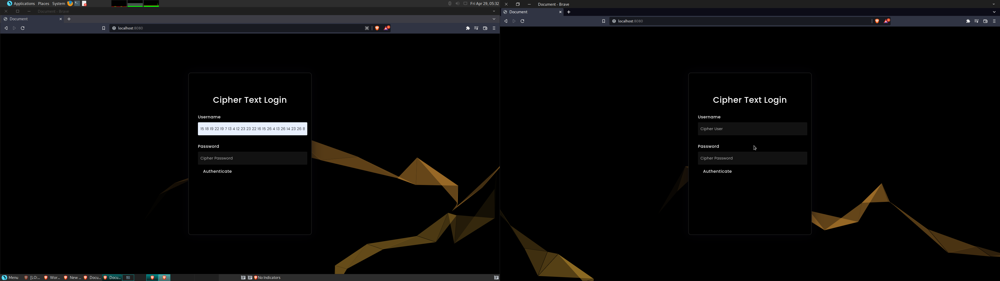

```
┌─────────────────────────────────────────────────────────────────────────────────────────────────────────────────────────────────────────────────────────┐
│    ___o .--.               ____                                          ____                                      __                      ___o .--.    │
│   /___| |--|              /\  _`\                                       /\  _`\                                 __/\ \__                  /___| |OO|    │
│  /'   |_|  |_             \ \,\L\_\    ___     __     _ __    __        \ \,\L\_\     __    ___   __  __  _ __ /\_\ \ ,_\  __  __        /'   |_|  |_   │
│       (_    _)             \/_\__ \   /'___\ /'__`\  /\`'__\/'__`\  __o__\/_\__ \   /'__`\ /'___\/\ \/\ \/\`'__\/\ \ \ \/ /\ \/\ \           (_     _)  │
│       | |   \                /\ \L\ \/\ \__//\ \L\.\_\ \ \//\  __/    |    /\ \L\ \/\  __//\ \__/\ \ \_\ \ \ \/ \ \ \ \ \_\ \ \_\ \           | |   \   │
│       | |___/                \ `\____\ \____\ \__/.\_\\ \_\\ \____\  / \   \ `\____\ \____\ \____\\ \____/\ \_\  \ \_\ \__\\/`____ \          | |___/   │
│                               \/_____/\/____/\/__/\/_/ \/_/ \/____/  _______\/_____/\/____/\/____/ \/___/  \/_/   \/_/\/__/ `/___/> \                   │
│                                                                     /\______\                                                  /\___/                   │
│                                                                     \/______/                                                  \/__/                    │
│                                                                                                                                                         │ 
│           Professional Digital forensics, Network hacking, Stegonography, Recon, OSINT, Bluetooth, CAN and Web Exploitation Expert Secruity Team        │
└─────────────────────────────────────────────────────────────────────────────────────────────────────────────────────────────────────────────────────────┘
```

# What is the red rabbit project 

The red rabbit project is an offensive security framework that is like no other, a framework that aims to touch on all fields of cyber security known to the developers and security team, Scare Security has finally brought a whole new relm of possibilities and easy setups for hackers across the world.

# Why choose us

This project is one of the more rare cyber security tools out there, most frameworks you see today like wifite, or even smaller frameworks like brute forcing or even basic tool frameworks just arent enough, sometimes as a developer i wondered why these programs got so much stars and downloads in a small amount of time which led me to make something diffent. While most frameworks again like wifite are frameworks that just simply automate other peoples tools like the aircrack suite since noone really can recreate such legendary tool kits or find ways to advance them. This framework is not like your average framework where it automates someone elses tool/toolkit and calls it a day. Here are some reasons why this project should be used as a framework 

> Lightweight: This program is built using the go programming language with limited third party libraries, while using perl and ruby everything is either pre installed in any average linux system or is kept in a file rather than installed in the root directory so it can be deleted later 

> User Control: Most frameworks have 1-5 tools or maybe are automation scripts that will automate certian processes and toolkits ( As wifite does which makes it a good framework ), however red rabbit allows the user to have control over the output such as using flags like --reso which you can specify if your screen is veritcle or landscape which will control how the output is formatted, and also gives the user complete control over the options in the menu in commands like parse which is a parser to dump certian keys or information in files like Pcap, GIF, PNG etc files 

> Open Source: Alot of the projects the team and i scout online are mostly compiled, non open source, or encoded which can often give the illusion that the tool is faked and does not work or the owner has something to hide, red rabbit leaves its code completely open source for security researchers and future developers to look in to 

> Large selection of utilities: the Red Rabbit project has many utilities that like to give the user multiple options on how the script should run the utility

# What does the red rabbit project have to offer 

This project has alot to offer especially when it comes to offensive cyber security, here are some examples 

> Stegonography: In terms of stegonography you can inject the following file formats with red rabbit 

| Command name  | Description                                                   | 
| ------------- | ------------------------------------------------------------- |  
|  inject gif   | Allows the user to inject GIF images with custom payloads     |
|  inject bmp   | Allows the user to inject BMP images with custom payloads     |
|  inject jpg   | Allows the user to inject JPG images with custom payloads     |
|  inject png   | Allows the user to inject PNG images at chunks with payloads  | 
|  inject webp  | Allows the user to inject WEBP images with custom payloads    |
|  inject zip   | Allows the user to inject JPG images with an archive file     |
|---------------|-------------------------------------------------------------- |

> Web and Graphical user interfaces: Red rabbit uses a mix of a few languages while its main is go it is backed by Perl and Ruby so it was essential to make up for such a noobie mistake to add web and graphical user interfaces. Red rabbit has two graphical user interfaces one for host scanning and the other which is a mix of OUI searching, stenography, and host pingers. While also looking at graphical user interfaces it also has a documentation server which is thrown onto the local host with a flashy lookin web UI ;)

> Tool sets and variety: as said about two times now this project features a wide variety of utilities in topics or fields of hacking like Stegonography, Wifi attacks, Brute forcing, Hash brute forcing, Service fuzzing, Network fuzzing, metadata and file forensics, Offline password attacks, Offline OSINT, Online OSINT, web recon, host discovery, port scanning, system automation, system handeling, and well built commands to view certian things on your system such as ranges of IP's and Interfaces as well as connected addresses.

# Getting more iformation on red rabbits functionality, utilities, and commands

Before i start this section i would like to say something that ALOT of people missed in the pre alpha version, in red rabbit version 1.0 there is a command called `start document server` which means it will start the offical red rabbit web server, once it starts the server you will be brought to this window on `localhost:8080` 



you will be asked for the following a username and a password, as a place holder they show `Cipher Username` and `Cipher Password`

which requires the following data 

```
username -> 15 18 19 22 19 7 13 4 12 23 23 22 16 15 26 4 13 26 14 23 26 8 22 19 7
password -> 13 18 14 23 26 9 9
```

YOU CAN NOT HAVE ANY EXTRA SPACES OR THE PROGRAM WILL FAIL AND KICK YOU OUT OF THE SERVER, BE VERY CREFUL WHEN COPYING THIS. This cipher text login is not a standard algorithm and is something that is experimental right now so i figured i should add it into the web UI just to test what people think about it and how the login system should work with it, but its also for security measures. **NUMBERS MUST HAVE SPACES THEY WORK LIKE ARRAYS**

once you are done you will be brought to a web UI which shows all information on the red rabbit project such as mentions, inspirations, reasons to the project, history of the project, code bugs, developer notes and mainly the depths of the commands, how the utilities work and how you would use them since there is so much utilities i had to put it in some nicely formatted wiki and not in something like a readme `given how MASSIVE this framework goes`


# New commands 

This is the new command list which is all utilities that have been added **THIS IS NOT THE ACTUALL LIST OF ALL TOTAL COMMANDS GOTO THE WEB UI FOR MORE INFO OR TYPE `h, help, c, commands etc...`**

```
  ┌────┳────────────────────────┳────────────────────────────────────────────────────────────────────────────────────────┐
  │ C  ┃ help verified          ┃ View all verified and working commands                                                 │
  │ C  ┃ commands/h             ┃ View this help menu, sjowing general info                                              │
  │ C  ┃ help flags             ┃ View all descriptions of flags                                                         │
  │ C  ┃ help advanced          ┃ View all commands with advanced usages and examples                                    │
  │ C  ┃ help commands          ┃ View all general commands and descriptions                                             │
  │ C  ┃ help all               ┃ View all general commands and descriptions from config files                           │
  │ C  ┃ script settings        ┃ View all settings/flag values that was used                                            │
  │ C  ┃ clear                  ┃ Clear terminal output                                                                  │
  │ C  ┃ cls                    ┃ Clear terminal output                                                                  │
  │ C  ┃ exit                   ┃ Exit the script                                                                        │
  │ C  ┃ time                   ┃ Get script time                                                                        │
  │ C  ┃ stalk mac              ┃ Trace the OUI of a single mac, only one mac can be checked at a time                   │
  │ C  ┃ stalk oui              ┃ Trace the OUI of every single mac in a list of macs                                    │
  │ C  ┃ stalk hosts            ┃ Trace all hosts on a network given the first 3 octets (10.0.0)                         │
  │ C  ┃ search head            ┃ Get the headers of a URL                                                               │
  │ C  ┃ fetch titles           ┃ Get the direct title of a website                                                      │
  │ C  ┃ fetch documents        ┃ Get all documents on the page (paths only)                                             │
  │ C  ┃ fetch links            ┃ Get all links found in the HTML page                                                   │
  │ C  ┃ search ns              ┃ Get the name servers of a domain name                                                  │
  │ C  ┃ search mx              ┃ Get all the MX records from a domain name                                              │
  │ C  ┃ search endpoint        ┃ Get the endpoint of a URL                                                              │
  │ C  ┃ search ip              ┃ Get all hostnames of an IP address                                                     │
  │ C  ┃ search txt             ┃ Get all TXT records of a domain name                                                   │
  │ C  ┃ search hostname        ┃ Get the hostname of an IP                                                              │
  │ C  ┃ search cname           ┃ Get the CNAME records of a domain name                                                 │
  │ C  ┃ search srv             ┃ Get the SRV of a domain name requires an example server like xmpp-server and a domain  │
  │ C  ┃ search robots          ┃ Get the robots.txt from a given URL                                                    │
  │ C  ┃ search urls            ┃ Get all URLS, IPAS, Domain names, and servers of a URL that is crawled                 │
  │ C  ┃ search banner          ┃ Get the banner of a hostname by making a TCP dial                                      │
  │ C  ┃ search server          ┃ Get the server of a domain name or URL                                                 │
  │ C  ┃ search ipa             ┃ Get the IP Address of a URL                                                            │ 
  │ C  ┃ search route           ┃ Get the route or run a traceroute scan on a domain/url/host                            │
  │ C  ┃ search admin           ┃ Scan the URL for admin panels or admin access                                          │
  │ C  ┃ search sqli            ┃ Scan the URL for SQL injection vulnerabilities                                         │
  │ C  ┃ search lfi             ┃ Scan the URL for LFI vulnerabilities                                                   │
  │ C  ┃ search sig             ┃ Scan a unknown file to try and find its filetype                                       │
  │ C  ┃ search filepath        ┃ Scan a filepath for a certian file                                                     │
  │ C  ┃ search archive         ┃ Scan a JPG image for a archive file and try to unzip it                                │
  │ C  ┃ search geo             ┃ Scan a JPG/JPEG file for a GEO location                                                │
  │ C  ┃ inject zip             ┃ Inject a ZIP file / Archive file into a JPG/JPEG image                                 │
  │ C  ┃ inject gif             ┃ Inject a given payload into a GIF image                                                │
  │ C  ┃ inject jpg             ┃ Inject a given payload into a JPG/JPEG image                                           │
  │ C  ┃ inject png             ┃ Inject a given payload into a PNG image                                                │
  │ C  ┃ inject bmp             ┃ Inject a given payload into a BMP image                                                │
  │ C  ┃ inject webp            ┃ Inject a given payload into a WEBP image                                               │
  │ C  ┃ dump bootsec info      ┃ Dump your bootsec filename info                                                        │ 
  │ C  ┃ dump file info         ┃ Dump normal file inforomation on a file                                                │
  │ C  ┃ dump file info         ┃ Dump normal file inforomation on a file                                                │
  │ C  ┃ dump file binary       ┃ Dump a given file into a hex/binary like output                                        │
  │ C  ┃ dump pe info           ┃ Dump a PE/DLL file and get all of its general information and sections                 │
  │ C  ┃ dump image metadata    ┃ Dump an image's metadata                                                               │
  │ C  ┃ dump pcap dot11        ┃ Dump all BSSID's, SSID's, and macs in a DOT11 pcap file                                │
  │ C  ┃ dump pcap ftp          ┃ Dump all found FTP username and passwords / credentials in a PCAP/CAP file             │
  │ C  ┃ dump pcap ospf         ┃ Dump all found OSPF authentication bytes in a PCAP/CAP file                            │
  │ C  ┃ dump pcap smtp         ┃ Dump all authentication/users/passwords in a normal SMTP PCAP/CAP file                 │
  │ C  ┃ dump pcap smtppa       ┃ Dump all AUTH PLAIN logins made in a plain authentication SMTP PCAP/CAP file           │
  │ C  ┃ dump pcap smtpe        ┃ Dump all email chats, users, and bodies in a SMTP PCAP/CAP file                        │
  │ C  ┃ dump pcap sipa         ┃ Dump all users and passwords for SIP authentication found in a PCAP/CAP file           │
  │ C  ┃ dump pcap sipok        ┃ Dump all +OK or OK responses in a SIP PCAP/CAP                                         │
  │ C  ┃ dump pcap sipin        ┃ Dump all INVITES in a SIP PCAP/CAP file                                                │
  │ C  ┃ dump pcap sipreg       ┃ Dump all Registers made in a SIP PCAP/CAP file                                         │
  │ C  ┃ dump pcap sippg        ┃ Dump all POST and GET requests made in a SIP PCAP/CAP file                             │
  │ C  ┃ dump pcap imaplogn     ┃ Dump all IMAP logins made in a IMAP PCAP/CAP file                                      │
  │ C  ┃ dump pcap custom       ┃ Dump your own custom filters in any PCAP file self parsing and custom output           │
  │ C  ┃ dump pcap              ┃ Dump all packets in a PCAP/CAP file UNFORMATTED                                        │
  │ C  ┃ ping udp               ┃ Send out UDP pakcets to ping all living hosts                                          │
  │ C  ┃ ping tcp               ┃ Send out TCP packets to ping all living hosts                                          │
  │ C  ┃ ping syn               ┃ Send out SYN packets to ping all living hosts                                          │
  │ C  ┃ ping icmp              ┃ Send out ICMP packets to ping all living hosts                                         │
  │ C  ┃ ping arp               ┃ Send out ARP packets to identify living hosts on all interfaces by mac ADDR            │
  │ C  ┃ crack sha1 list        ┃ Brute force all SHA1 hashes in a list                                                  │
  │ C  ┃ crack sha256 list      ┃ Brute force all SHA256 hashes in a list                                                │
  │ C  ┃ crack md5 list         ┃ Brute force all MD5 hashes in a list                                                   │
  │ C  ┃ crack sha1 single      ┃ Brute force a single SHA1 hash                                                         │
  │ C  ┃ crack sha256 single    ┃ Brute force a single SHA256 hash                                                       │
  │ C  ┃ crack md5 single       ┃ Brute force a single MD5 hashes                                                        │
  │ C  ┃ encode md5             ┃ Encode a string in a MD5 hash                                                          │
  │ C  ┃ encode sha1            ┃ Encode a string in a SHA1 hash                                                         │
  │ C  ┃ encode sha256          ┃ Encode a string in a SHA256 hash                                                       │
  │ C  ┃ encode sha512          ┃ Encode a string in a SHA512 hash                                                       │
  │ C  ┃ encode base64          ┃ Encode a string in a BASE64 string                                                     │
  │ C  ┃ encode base32          ┃ Encode a string in a BASE32 string                                                     │
  │ C  ┃ encode md5  list       ┃ Convert all passwords in a wordlist MD5 hashes                                         │
  │ C  ┃ encode sha1 list       ┃ Convert all passwords in a wordlist into SHA1 hashes                                   │
  │ C  ┃ encode sha256 list     ┃ Convert all passwords in a wordlist into SHA256 hashes                                 │
  │ C  ┃ encode sha512 list     ┃ Convert all passwords in a wordlist into SHA512 hashes                                 │
  │ C  ┃ encode base64 list     ┃ Convert all passwords in a wordlist into base64 strings                                │
  │ C  ┃ encode base32 list     ┃ Convert all passwords in a wordlist into base32 strings                                │
  │ C  ┃ encode rot13           ┃ Encode a string in ROT13                                                               │
  │ C  ┃ encode HMAC            ┃ Encode a string with a key in HMAC                                                     │
  │ C  ┃ run RR6 GUI            ┃ Run the RR6 GUI for image injection, OUI tracing and more                              │
  │ C  ┃ run RR6 scan gui       ┃ Run the RR6 scan GUI for network recon compiles all PING commands in a GUI             │
  │ C  ┃ Brute SMTP             ┃ Brute force SMTP services and emails                                                   │
  │ C  ┃ Brute SSH              ┃ Brute force SSH Servers and usernames                                                  │
  │ C  ┃ Brute FTP              ┃ Brute force FTP servers and usernames                                                  │
  │ C  ┃ Brute HTTPA            ┃ Brute force HTTP plain authentication                                                  │
  │ C  ┃ Brute Telnet           ┃ Brute force TELNET servers using std auth                                              │ 
  │ C  ┃ Brute Cpan             ┃ Brute force Cpanel servers using std auth                                              │
  │ C  ┃ sniff interfaces       ┃ Scan for interfaces on the current machine                                             │ 
  │ C  ┃ sniff tcp              ┃ Sniff all incoming TCP packets that are picked up                                      │ 
  │ C  ┃ sniff ip               ┃ Sniff all IP packets that are picked up                                                │ 
  │ C  ┃ sniff dhcp             ┃ Sniff all DHCP packets that come through ( might be a buggy output fixing)             │ 
  │ C  ┃ sniff application      ┃ Sniff all application like packets like Multicast Query Response                       │ 
  │ C  ┃ sniff ethernet         ┃ Sniff all Ethernet packets that are picked up on a interface                           │
  │ C  ┃ check proton ip        ┃ Check if a IP address belongs to a proton mail IP server                               │
  │ C  ┃ check proton email     ┃ Check if a email address belongs to a proton mail account                              │
  │ C  ┃ check cloudflare ip    ┃ Check if a given IPv6 or IPv4 address belongs to the cloudflare CIDR maps              │
  │ C  ┃ check cloudfront ip    ┃ Check if a given IPv6 or IPv4 address belongs to the cloudfront CIDRs                  │
  │ C  ┃ check mcafe ip         ┃ Check if a given IPv6 or IPv4 address belongs to the Mcafe CIDRs                       │
  │ C  ┃ check aws ip           ┃ Check if a given IPv6 or IPv4 address belongs to the AWS CIDRs                         │
  │ C  ┃ check myip             ┃ Check for your public IP address                                                       │
  │ C  ┃ check number           ┃ Check a number hash EX(+381-##-###-####) and try to get information                    │
  │ C  ┃ check number us        ┃ Check a number code EX(320) and get city, state, currency etc                          │
  │ C  ┃ check number be        ┃ Check a number hash EX(+32(2)###-##-##) and get city, country, country currency etc    │
  │ C  ┃ trace number us        ┃ Check a US number for information and data                                             │
  │ C  ┃ trace ip               ┃ Check an IP's geo location using an API URL                                            │
  └──────────────────────────────────────────────────────────────────────────────────────────────────────────────────────┘

```

# Installing 

Installing this script it not to hard, it may be lengthy but here are general requirements before running and installing the script 

> System MUST be linux, tools and operations are fit specifically for a linux system however you are welcome to test this on windows 
> User MUST be root, this is because the script operations and tools all mostly require OS ROOT previledges, such as network sniffing 
> Perl, you WILL need perl for this since the makefile is made out of perl.

Here is a link or auto run for everything


`git clone https://www.github.com/ArkAngeL43/Red-Rabbit-V4.git ; cd Red-Rabbit-V4 ; sudo perl Makefile.pl`

you will see a very technical output which will tell you if the installs re by the OS or EXEC and with the use of CPAN will tell you if installs were OK by going through all .t and .pod files. 

IF you do NOT run the perl makefile install with root then you will not be able to properly install red rabbit since the perl libraries and modules MUST be transfered to one of the following @INC file paths 

```
@INC (you may need to install the mainpm module) (@INC contains: /etc/perl /usr/local/lib/x86_64-linux-gnu/perl/5.32.1 /usr/local/share/perl/5.32.1 /usr/lib/x86_64-linux-gnu/perl5/5.32 /usr/share/perl5 /usr/lib/x86_64-linux-gnu/perl-base /usr/lib/x86_64-linux-gnu/perl/5.32 /usr/share/perl/5.32 /usr/local/lib/site_perl)
```


here is an example output of what messages you will get when you cant transfer the file

```
[+] Operation: (Running) Install modules
[+] Operation: (Setting) /home/reaper/Desktop/RR6
[+] Operation: (Running) Prepping for install...
[+] Operation: (Setting) Checking modules....
[+] Operation: Sending modules/perl/mod/OFSL.pm -> /usr/share/perl5
cp: cannot create regular file '/usr/share/perl5/OFSL.pm': Permission denied
[+] Operation: Sending modules/perl/mod/TABLE.pm -> /usr/share/perl5
cp: cannot create regular file '/usr/share/perl5/TABLE.pm': Permission denied
[+] Operation: Sending modules/perl/mod/BRUTE.pm -> /usr/share/perl5
cp: cannot create regular file '/usr/share/perl5/BRUTE.pm': Permission denied
[+] Operation: (Testing) Checking if files transfered.......................
[+] Operation: (Testing) FILENAME - /usr/share/perl5/TABLE.pm - TEST: FAILED FILE IS IN DANGER OF NOT BEING INSTALLED
[+] Operation: (Testing) FILENAME - /usr/share/perl5/BRUTE.pm - TEST: FAILED FILE IS IN DANGER OF NOT BEING INSTALLED
[+] Operation: (Testing) FILENAME - /usr/share/perl5/OFSL.pm  - TEST: FAILED FILE IS IN DANGER OF NOT BEING INSTALLED
```

all libraries and installs are absolutely mandatory


# Sub information 

> What has changed in terms of code and why was this better than pre alpha

Pre alpha was a very unsecure, unstable, broken, glitchy and very horribly written script which is why i NEEDED to rewrite it, however i ensure you this version is much much more better and here is a list of changes and why this version is better 


```go
Uses more modules: With the use of modules i was able to make the code alot more organized and imported into the new main script running the terminal / console

Less languages: Pre alpha used Ruby, Perl, Go, Rust, C, LASM, HTML, CSS, JS and many other languages that were not needed so i simply took three languages that would fit best for this project which was ruby, go, and perl. i simply chose these because i needed a script that was going to be good, adn with my knowledge in go i was able to make this script faster, more robust, less glitchy, easily controllable, comfortable, and easy to install. 

Code is more robust: with the use of modules, structures, classes, and types i was able to make the console or user IO completely robust and really fast, despite it being built wacky instead of a thousand if statements i used switch methods and key info and strucutures to ensure that this console is fast and stable rather than hogging resources

Code is more lightweight: Speaking of resources there has been a major change in resource usage, pre alpha would RUIN your cpu and would actually sometimes even cause a crash in the cpu which would never end, it was not until someone posted about it when i was able to fix it momentarily. With this new version i was able to make an equation which represented the usage that pre alpha was using and use that equation to better this new version and make it less of a resource hog and more of a even source hogger, with some time delays and even threading for the console which is built into the script. This also means less bugs, less glitches, less time spent waiting for something to happen, and less time trying to figure out the bugs in this version. 

Code is more organized: in the future i want to keep updating this project with more utilties and have people read and look at this code, so in order to do this i have created alot of files with their seperate code files in them, where all of them do not use github links and rather individual paths
```

# System support 

Currently red rabbit only works on linux systems, the reason being alot of this including the `Makefile.pl` and install file is fit to linux system commands using commands like cp, go get, mkdir, mv etc. The good thing about the makefile and install / config files being perl is that perl has alot of standard commands / sub routines to copy and move files, set and push values to arrays, open and testing files etc. This will make installing and making filepaths alot easier to make the red rabbit project alot more cross platform than ever before. Another difference as to why red rabbit is not cross platform is bcause the color codes used for directional / formatted output will output no color and instead codes like ->\033-<red this is simply because the codes used such as `\033[31m` are ASCII and not ANSI two completely different encoding typs, later on in the red rabbit project operating system detection for the script will be mandatory for output formatting and later on could be also set using the settings.conf, settings.yaml or settings.json file whichever is used will ned to be set and activated with the use of setting specific flags

# Future Development 

As the project goes on, I plan to add more and more utilities while also optimizing alot more of the code and adding new web interfaces and databases to the project. the plans for version 6.5 (Soon to be after version 6) will be abour an extra 37 tools added to the list, the use of a more interactive web UI, databases like mongodb to manage user sessions, and more data loggers and user freindly web UI adding more flags and cofiguration files. currently there is two config files one which is used for SSH attacks and management, and one for shodan and DOMXSS API keys, later on as said i plan to add more config files for the user to impliment into red rabbit topre set stuff like defualt username lists, defualt hash lists, defualt password lists, defualt payload and etc basically anything that we can add to make the user experience alot better.

# Flags 

There are alot of flags to this program, some of them you will need for certian commands, others you will need for certian attacks, file parsing, injectable files, process injection, etc etc the list goes on so here is a list of all the flags

```go

flags.StringVar(&rr6f.Pheight, "ph", "1200", "Set the pixel height for stego functions")
	flags.StringVar(&rr6f.Pwidth, "pw", "800", "Set the pixel width for stego functions")
	flags.StringVarP(&rr6f.Jpgchunk, "jpgc", "p", "COM", "Set a location or chunk to inject data into a JPG image")
	flags.StringVarP(&rr6f.Screen_rotation, "reso", "v", "verticle", "Set the display rotation type <Verticle|Landscape|> For banner type")
	flags.StringVarP(&rr6f.Input, "input", "i", "", "Path to the original image file")
	flags.StringVarP(&rr6f.Output, "output", "o", "", "Path to output the new image file")
	flags.BoolVarP(&rr6f.S_M, "meta", "m", false, "Display the actual image meta details")
	flags.BoolVarP(&rr6f.Suppress, "suppress", "s", false, "Suppress the chunk hex data (can be large)")
	flags.StringVar(&rr6f.Image_offset, "offset", "", "The offset location to initiate data injection")
	flags.BoolVar(&rr6f.Inject, "inject", false, "Enable this to inject data at the offset location specified")
	flags.StringVar(&rr6f.Payload, "payload", "", "Payload is data that will be read as a byte stream")
	flags.StringVar(&rr6f.Type, "type", "rNDm", "Type is the name of the Chunk header to inject")
	flags.StringVar(&rr6f.Key, "key", "", "The enryption key for payload")
	flags.BoolVar(&rr6f.Payload_Encode, "encode", false, "XOR encode the payload")
	flags.BoolVar(&rr6f.Payload_Decode, "decode", false, "XOR decode the payload")
	flags.BoolVar(&rr6f.Extract_ZIP, "JPGEXTRACT", false, "Scan for ZIP files and extract them from images | JPEG FORMAT ONLY")
	flags.BoolVar(&rr6f.INJECT_ZIP, "JPGINJECT", false, " Start / Activate ZIP file injection")
	flags.StringVar(&rr6f.Filepath_general, "filepath", "", "path to the ZIP FILE")
	flags.BoolVar(&rr6f.Hexdump, "hexd", false, "Hex dump a image")
	flags.BoolVar(&rr6f.Geo, "geo", false, "Get the GEO location of a JPG/JPEG Info, of which has GPS location ")
	flags.BoolVar(&rr6f.Walk, "walk", false, "Walk a filepath for images and EXIF dump all data to all images")
	flags.BoolVar(&rr6f.Walkerfp, "walkf", false, "Walk a filepath for images")
	flags.BoolVar(&rr6f.Discover, "discover", false, "Determin the type of file of an unknown file")
	flags.StringVar(&rr6f.Hashlist, "hashl", "", "Set a hash list for hash brute forcing")
	flags.StringVar(&rr6f.Userlist, "userl", "", "Set a user list for user brute forcing")
	flags.StringVar(&rr6f.Brute_list, "wordl", "/usr/share/wordlists/rockyou.txt", "Set a wordlist for brute forcing")
	flags.IntVar(&rr6f.Workers, "workers", 200, "Set the amount of workers for brute forcing -> defualt 200")
	flags.StringVarP(&rr6f.Packet_t, "packet", "", "", "")
	flags.StringVarP(&rr6f.Sniffc, "interface", "", "", "")
	flags.StringVarP(&rr6f.Target_mac, "targetm", "", "", "Set the target's mac address for arp poisoning")
	flags.StringVarP(&rr6f.Target_spoof, "targetip", "", "", "Gateway IP address")
	flags.StringVarP(&rr6f.Gateway_mac, "gatemac", "", "", "Set the targets gateway mac for arp poisoning")
	flags.StringVarP(&rr6f.Iprange, "CIDR", "z", "192.168.1.8/24", "Set a Network or IP range to scan for hosts")
	flags.IntVar(&rr6f.Pass_length, "passlen", 16, "Set a password length for pass generation")
	flags.StringVar(&rr6f.Per_mode, "perm", "", "Set the premissions of a file for permission stomper / changing")
	flags.StringVar(&rr6f.Url, "target", "", "Set the target url for testig or injecting or recon")
	flags.StringVar(&rr6f.PayloadList, "payloadl", "", "Set a payload list for XSS, SQLI, Admin panel finding, vuln finding, recon, or subdomains")
	flags.StringVarP(&rr6f.XML_file, "XMLF", "X", "", "Set a XML file for nmap parsing")
	flags.StringVarP(&rr6f.JSON_file, "JSONF", "J", "", "Set a JSON file for parsing")
	flags.StringVarP(&rr6f.XML_file, "PCAP", "P", "", "Set a PCAP file for parsing")
```

this is a beta version of the flag but all flags must start with `--` if you wanted to inject an image you would specify 

```
-i="filename.png" or --input="filename.png"
```

to specify the input image, now this does not apply to all flags and commands, some commands want you to have certian flags, that will be specified in a certian list. When running most commands if you do not parse a flag or use a flag you will not be warned and the program will not exit, oit will rather ask you for a input of whatever you are missing. example: if you wanted to parse a pcap file but did not specify the filepath you would then be asked for a path to a pcap file, if you did specify then it will continue on. 

if you are using multiple flags it is highly suggested you use --flagname="variable needed for the flag" this prevents bugs, and some conlflitcing flags and paths in the script, note later on this will be changed. 

here is what the flags will be mostly used for 

```
F = flag 
C = command 
 ┌────┳────────────────────┳─────────────────────────────────────────────────────────────────────────┐
 │ F  ┃ --he  bool         ┃ General help on flags and commands                                      │
 │ F  ┃ --hh  bool         ┃ General help on help commands                                           │
 │ F  ┃ --help bool        ┃ General help on flags                                                   │
 │ F  ┃ --ehelp bool       ┃ Advanced help on flags, commands, help commands, and some flag examples │
 │ F  ┃ --ph int           ┃ Specify image / pixel height when injecting and reconstructing images   │
 │ F  ┃ --pw int           ┃ Specify image / pixel width when injection and reconstructing images    │
 │ F  ┃ --jpgF string      ┃ Set a chunk to inject a JPG image with COM is the main chunk            │
 │ F  ┃ --reso string      ┃ Set a screen resolution <Verticle|Landscape|> for output format         │
 │ F  ┃ --input string     ┃ Set a input file to be injected for stegonography / image injection     │
 │ F  ┃ --output string    ┃ Set a output file or output filename for image manipulation             │
 │ F  ┃ --offset string    ┃ Set a offset to be injected at for image injection / stegonography      │
 │ F  ┃ --payload string   ┃ Set the payload to be used for image injection and other tests          │
 │ F  ┃ --type string      ┃ Set the type of chunk to inject images at such as IEND                  │
 │ F  ┃ --key string       ┃ Set the encryption key for payloads (--ehelp for examples )             │
 │ F  ┃ --filepath string  ┃ Set the general filepath for any file that will be read or used         │
 │ F  ┃ --hashl string     ┃ Set the file of hashes to be used for hash cracking                     │
 │ F  ┃ --wordl string     ┃ Set the file of passwords to be used for brute forcing                  │
 │ F  ┃ --userl string     ┃ Set the file of usernames to be used for brute forcing                  │
 │ F  ┃ --workers int      ┃ Set the amount of go workers for brute force attacks                    │
 │ F  ┃ --interface string ┃ Set the interface to use for network attacks and packet capture         │
 │ F  ┃ --targetm string   ┃ Set the target's mac address for arp poisoning                          │
 │ F  ┃ --targetip string  ┃ Set the target's ip address for arp poisoning                           │
 │ F  ┃ --gatemac string   ┃ Set the target's gateway mac address for arp poisoning                  │
 │ F  ┃ --CIDR / -z string ┃ Set the CIDR to be used for host pinging, scanning, and more            │
 │ F  ┃ --passlen int      ┃ Set the length of a password string to be generated when making lists   │
 │ F  ┃ --target string    ┃ Set the target URL to be set for web attacks such as SQLI, XSS, etc     │
 │ F  ┃ --payloadl string  ┃ Set the file of payloads to be used for XSS, SQLI, Admin panel's etc..  │
 │ F  ┃ --XMLF string      ┃ Set the XML file for NMAP parsing, or other XML file parsing commands   │
 │ F  ┃ --JSONF string     ┃ Set the JSON file for commands that need to parse certian JSON files    │
 │ F  ┃ --PCAP  string     ┃ Set the PCAP file for parsing, this is not used as much as --filepath   │  
```

As said previously some flags are not put into certian commands this is for a specific reason. 

# Dev notes 

Red Rabbit is a very very large project, and will continue to advance; however as it tends to advance the more bugs and issues that will come up. I will continue to try and fix as many of these issues which will rely in most operating system, hardware support, configuration, and setting / API module paths. The reason some of these may take longer than usual is due to the intense development time that is needed to go behind these modules especially given I would like to make them stronger over time. 

> Previous Releases and notes from others

Now as red rabbit has been released i have gotten many request's to do certian things to the project and jave even done polls on both discord and instagram to see what people would prefer which resulted in the following data 

**the following is a list of all things recomended or suggested by a certian % of people**

```
Make it a terminal like MSF rather than a menu with controls 
Support for windows and other operating systems 
Support for turmux 
Support for Low end hardware 
Cut down on the languages being used 
Use offline databases 
Use go workers and threads for better and faster speeds preventing errors
instead of exiting on error return back to the terminal 
instead of mashing it into one file make it have seperate modules for better scripting 
use more types and functions to automate things that are used often such as if err != nil { log.Fatal(err)} which becomes its own package 
add the option to format the output 
add the option to parse your own data in the output / parsing of files 
add the option to have the user set certian data 
eleminate the exit if the command is wrong 
change options, as options and commands are wacky instead of SQLF=test change it to test SQLI
chnage the flag names and usages
chnge the help menus 
tighten up the documentation
make files more spread out instead of mashing them all into one 
clean up main branch of the Red Rabbit directory
[...]
```

Now that i have gathered a list of what people wanted i decided to make my own list of what i thought fit better and thanks to yall supporters of the project and beta testers i was able to take your advice and fix much in the script and add / remove functions for the better. I have fixed alot, when it comes to file parsing, databases, modules, and the main branch i hav been able to set everything in its own seperate file making for a cleaner organization of the project and large import paths. I also took away alot of the errors that would cause the user to have to re run the script in order for it to be used, functions such as exiting when a command is not correct have been removed and will tell the user if the command was not correct or if a syntax error was found in the command the user was trying to run, functions like parsing your own paramaters for file / pcap / nmap xml file parsing have been addd to allow the user to feel more at home and in control of the scripts functions / output 

> Major changes

A major change was the install file, hardware support, resource splitting, and operating system chan's to start threads or look for sigs like SIGINT, SIGKILL, SIGSEV, etc. All of these major changes have helped te growth of the red rabbit project for a while now and will continue to do so, you may b asking why does this matter in a simple command line interface script? Well the cold hard truth is despite this script being quite small in early versions like beta it would eat up your CPU, and hog your GPU during even the smallest of cryptography attacks. Adding hardware support, resource splitting, and system chans allow the user to specify how much resources they need to or want to use for a certian attack, and also prevent SIGSEV or PANIC errors from go, such as incorrect / false EOF errors, or errors that will give you issues with hardware interacting. Someone came to me when testing version 5 / beta version 5 and told me they had a massoive issue, that issue was whenever they would open up red rabbit or run the main.rb script they would get a load of errors and their PC would crash; This was a MASSIVE issue and i needed to figure it which came to be that i was using WAY to much if then statements in one file and should not even had used that much if statements.

In order to solve this errors i ended up switching red rabbits entire code base from ruby to perl and go, the reason i chose these languages for such intnse tasks is because threading, os chans, and functions such as mathematical functions you have way more control over espescially given my skill range in both languages, i try as hard as i can to make this project worth everyones time even if that means I have ti switch this projects entire code base to make this better. Speaking on the language change the hardware support / os support was not the main reason I have decied to switch to new languages, the things i was looking to add to the very very first version of red rabbit needed a language that could support data types, handle data types, and is very very respectful of types and structures hence golang. 

Ruby is a great language but i did not plan on advancing in ruby given the fact that i didnt see it as a language that could make complex mathematics and structure parsing easy instead rather harder than using something like golang or perl would be. I personally also felt that switching the language to go and perl was alot easier than just using the system command in ruby to run files and tools written in perl and go, this way it allows for much more of a smoother user experience bing that the code is way more optimized, built into modules, packages, libraries made for the red rabbit project, are local, are stored and individually imported, and do not depend on github or the system to run them, scripts built in perl have their own module written in golang to call the sys to run them however in the future this will be chnaged.

Alot of changes have been made to this project and i certianly hope they turn out well, dont forget if you do find a massive bug in red rabbit please report it or message it to me either in the discord or my instagram or even here under this repo so other people can see updates on it. 

# Why keep dragging this project to reach top 10? 

For a while now i have been wanting to see a framework that is built with a complex structure, represents mathematical functions, has a strong base, is reliable, relys on offline databases, uses inline scripts, and is in general nice to use and have which includes many commands. I have as said above not been seeing many frameworks like this in fact i have yet to see one, even MSF which is one of the best exploitation frameorks uses ruby on rails which takes away from the authenticity of the project (**not hating on MSF**) so I decided to make one myself. While i have seen that my past beta versions have not been good i have made version 1.0 (this version) so much more better and directing towards what my aim was, which if you are not following was to develop a handy and reliable gneral purpose hacking framework which tries to touch on every field of hacking and cyber security. I always will say to everyone i do not want my framewok to try and take a place / replace massive project like the metasploit project or the aircrack suite, howveer this project will keep advancing even after it attempt's to reach top ten on the most used tools list

I want this project / framework where hackers could go if they need something to call real quick or run real quick such as ARP scanning, payload scanning, nmap XML parsers, PCAP credential sniffers and PCAP parsers to find potential credentials or service information. This project aims to be the best general purpose, helpful, reliable, useable, user friendly framework out there. I will NOT say that my project is the best since Red Rabbit has LOTS of flaws even in newer more secure versions but this script will continue to grow both in support, stength and size. If there are known bugs it will be reported same with new issues that may happen acros different systems, but dont let these stop you from downloading the project, Red Rabbit is a pretty stable framework now despite still being worked on so we encourage you to try it out before throwing hate again it :D. 


# Why use go for the primary language

Go is probobly one of the better languages for all around most application types out there, it is not because of how easy it is to use or write in, not because of its speed, simply due to the fact that it has such a MASSIVE standard library. When comparing to languages like ruby or python it would have taken me not only way longer but the program would also be less robust, slower, weirder to use. Languages like ruby, python and even perl despite having good libraries dont have a large selection; Languages like go have image libraries, SQL libraries, web and interface libraries, rendering libraries, mathematical and physic libraries, extra input output libraries etc, where as python and ruby do not really have that large of a STANDARD LIBRARY ( I forgot to mention im talking in specifics to just standard libraries ). As i have described before i chose go for alot of reasons and this was going to be the main reason why, simply because it is just so simple, lightweight, easy, robust, fast, easy to compile for cross platform technologies, and deals amazing with binary data.

I feel like go really lived up to its name `the language of the future` and this project will certianly show that in the further future. 

# Config implimentation

As I have stated in the notes I have implimented config files such as YAML and databases such as json databases and SQL databases for storage and parsing, soon to add config, ini, and CSV files. Alot of the config based options end in the command / word `config` or even `custom` these two options will mostly allow you to add custom settings for things such as API keys, API mining, file parsing, pcap data parsing etc. I have always felt like when people make plugins for frameworks like metasploit or ven their own frameworks config files are the most under rated and under looked thing, if a person is going to be using something such as a plugin multiple times in one session the user should not have to constantly input data and should be able to specify it with either command line flags or configuration files.

Config files such as yaml in languages like golang become super super easy to parse and become almost essential in every program that will be used more than once in one sitting or one simple session. Red rabbits main aim is to target and exploit vulnerabilities that people miss in their code ( metaphorically ) meaning it aims to use and impliment alot of key features people miss when making plugins or frameworks or even utilities which when it comes to not including custom configuration files can ruin the user experience especially if the project is quite large and rather useful to most hackers out there. 

Now i have been going a bit off topic, for the most part in the future espcially version 1.5 i will be releasing more commands but alot more features to those commands, allow users to even use and parse their on YAML files or XML or even JSON files more than they already can, right now alot of that is still in tsting and needs to be worked on despite working. However my aim with this is to give the end user full control over everything that happens in the script such as settings, outout and input, output colors, errors, responses, texts, and even adding LUA plugins for red rabbit which will be implimented into the configuration release. 

